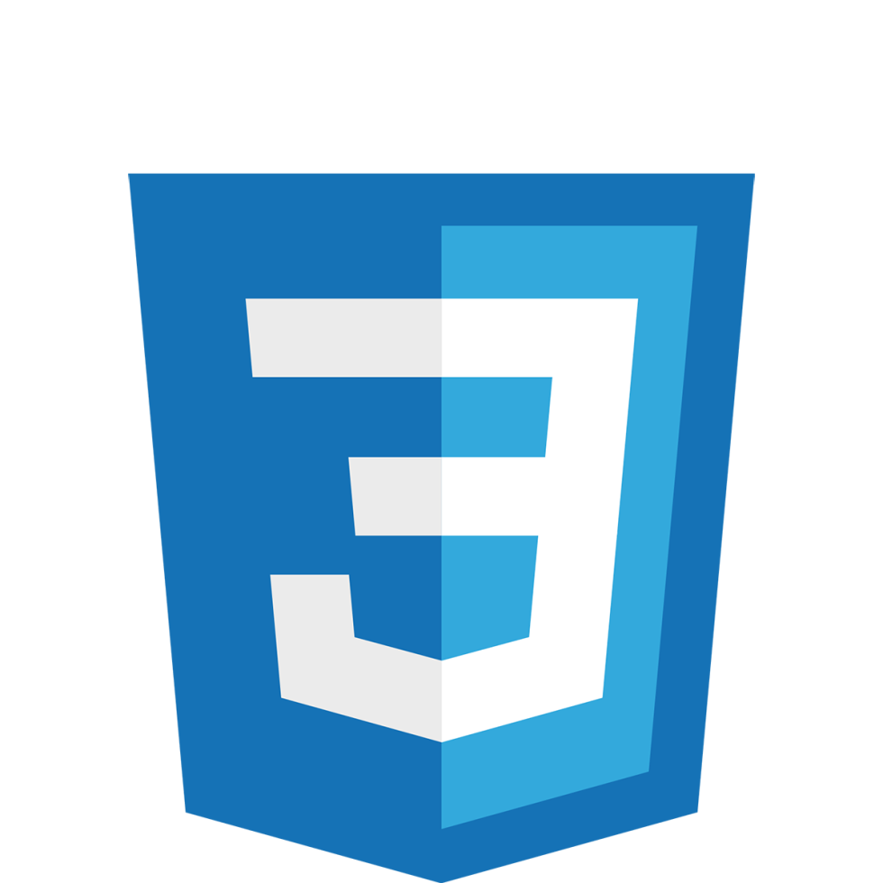

<h1>Hi I'm Nathan</h1>

---

---

<!--
**polarbear23/polarbear23** is a ✨ _special_ ✨ repository because its `README.md` (this file) appears on your GitHub profile.
- 🔭 I’m currently working on a 
- 🌱 I’m currently learning at bool
- 👯 I’m looking to collaborate on ...
- 🤔 I’m looking for help with ...
- 💬 Ask me about ...
- 📫 How to reach me: ...
-->

