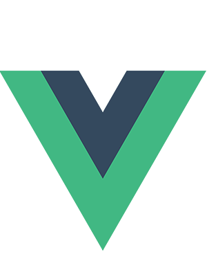

<h1 align="center">Hi there, I'm Nathan.</h1>

I'm a full-stack developer with a background in mathematics and private tutoring.

After an intensive full-stack bootcamp at Boolean UK, I am looking for a position as a junior developer.

---

    
    
    
    
    
    
    
    
    

---

<h2 align="center">Check out some of my projects...</h2>

- <h3>Project Manager</h3>
